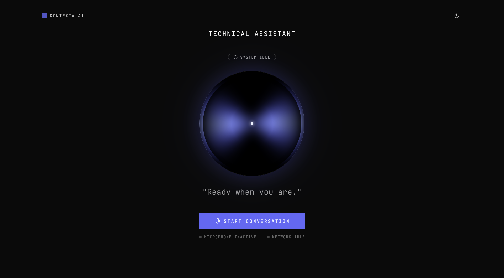
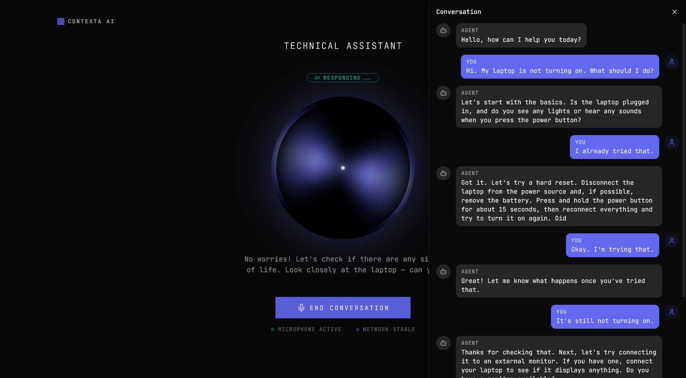
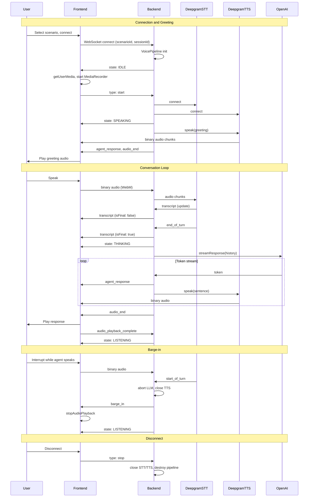

## SDE Intern Assignment – Contexta (Context-Aware Voice Agent)

**Live URL:** [https://contexta-alpha.vercel.app](https://contexta-alpha.vercel.app)

**Demo Video:** [https://www.loom.com/share/7a595f84e511493ea9eba0795f6a2bd2](https://www.loom.com/share/7a595f84e511493ea9eba0795f6a2bd2)

### 1. Overview

Contexta is a real-time conversational agent that streams both text and audio responses with low latency. It is built as a full-stack application with a Next.js frontend and a Node.js backend optimized for streaming and barge-in interactions.

### Screenshots





### Sequence Diagram



### 2. Selected Services

- **STT**: Deepgram Flux
- **LLM**: OpenAI `gpt-4o-mini`
- **TTS**: Deepgram Aura 2
- **Frontend Deployment**: Vercel
- **Backend Deployment**: Railway

### 3. Latency Optimization Approach

The LLM response is streamed token by token. As soon as the accumulated tokens form a complete sentence (a `.`, `?`, or `!` is detected), that sentence is sent to Deepgram for TTS. Deepgram's audio output is then streamed to the frontend in chunks over WebSockets without waiting for the entire sentence to be converted, minimizing perceived latency.

### 4. Features

1. **Barge-in**: If the agent is speaking and the user interrupts, the agent stops speaking and immediately starts processing the new user input.
2. **Streaming**: The LLM's response is streamed to the frontend in real time, both as text and as audio.
3. **Session memory**: The agent maintains memory of the session, and the full session context is sent to the LLM so the agent remains truly context-aware.
4. **Transcript streaming**: The full transcript of the conversation between the user and the agent is streamed to and visible on the frontend.
5. **Easy scenario creation**: New scenarios can be created by adding a scenario object in `backend/src/scenario/index.ts`. Each scenario requires:
   - **id**
   - **name**
   - **greetingMessage**
   - **systemPrompt**
6. **Live deployed**: Production deployment available at `https://contexta-alpha.vercel.app`.

### 5. Trade-offs

**Acoustic feedback at high volume:** When the system audio is turned up, the microphone can pick up the agent's speech from the speakers and send it back to the backend as if it were user input. A straightforward mitigation would be to mute the microphone while the agent is speaking. However, that would disable the barge-in feature, which relies on the microphone remaining active during agent playback so the user can interrupt at any time. As a result, there is an inherent trade-off between preventing acoustic feedback and supporting natural, interruptible conversations.

### 6. Setup Instructions

#### Backend

```bash
cd backend
npm install
npm run dev
```

Create a `.env` file in the `backend` directory with:

- `OPENAI_API_KEY`
- `DEEPGRAM_API_KEY`
- `FRONTEND_URL`

#### Frontend

```bash
cd frontend
npm install
npm run dev
```

Create a `.env.local` file in the `frontend` directory with:

- `BACKEND_URL`
- `NEXT_PUBLIC_WS_URL`
